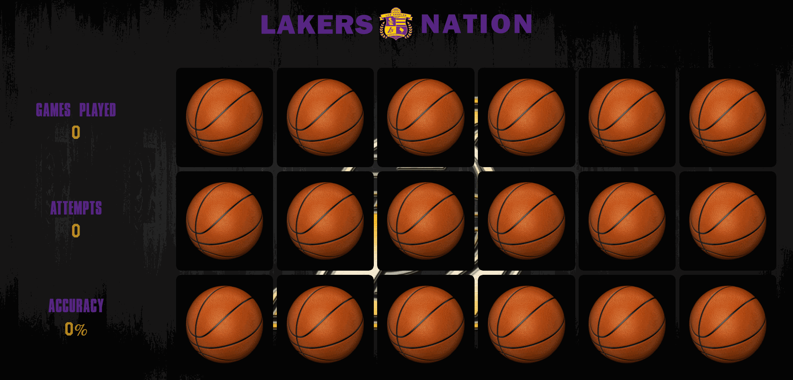

# Lakers Memory Match
NBA Lakers-themed card matching game with live statistics tracking and animations.
Both mobile and desktop responsive.

# Live Demo
Link: https://lakers-memory-match.timothywlee.com

# Technologies Used
* JavaScript
* jQuery
* HTML5
* CSS3
* Media Queries
* AWS EC2

# Features
* Users can flip cards that they can potentially match
* Users can play multiple games
* Users can keep track of stats 
* Users can see their accuracy during the game

# Preview


## Getting Started
1. Clone the repository.
``` 
git clone https://github.com/timothywlee/lakers-memory-match
cd lakers-memory-match
```
2. Run default server 
```
Go to the index.html file
Right click and run live default server 
```
